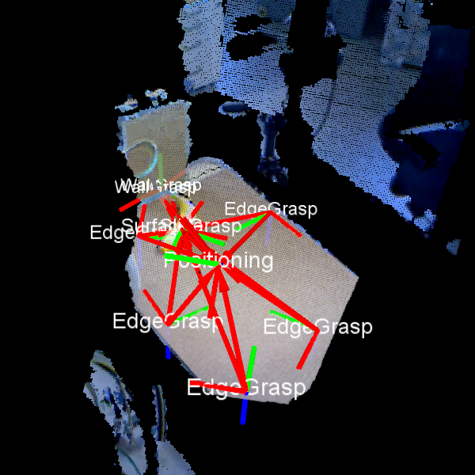
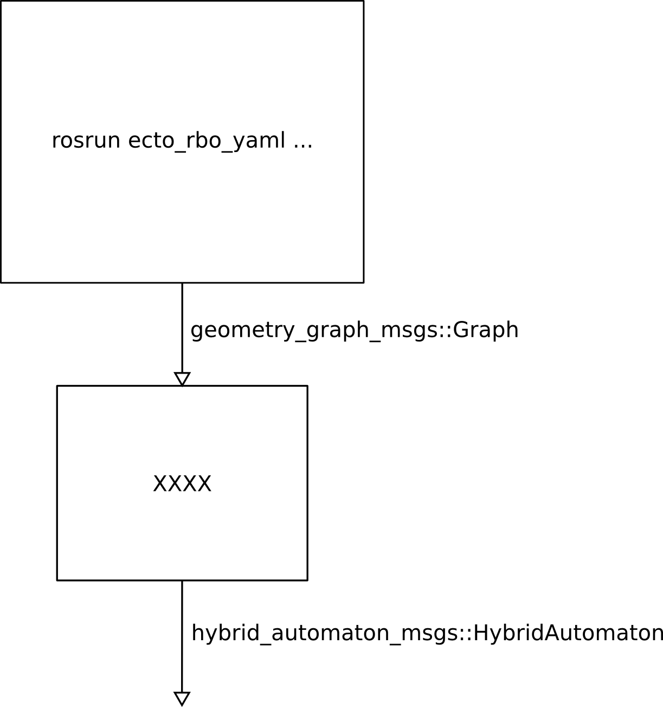

# Grasp Planner based on Environmental Constraint Exploitation

## Table of Contents

1. [Overview](#overview)
2. [Install](#install)
   1. [Minimal Dependencies](#minimaldependencies)
   2. [Dependencies For Running the Gazebo Example](#gazebodependencies)
3. [Usage](#usage)
4. [Examples](#examples)
   1. [Planning Based on PCD Input](#example1)
   2. [Planning Based on Continuous RGB-D Input](#example2)
   3. [Kuka Arm in Gazebo Simulation with TRIK Controller](#example3)

---

## Overview <a name="overview"></a>



This is based on:

Clemens Eppner and Oliver Brock. "[Planning Grasp Strategies That Exploit Environmental Constraints](http://www.robotics.tu-berlin.de/fileadmin/fg170/Publikationen_pdf/eppner_icra2015.pdf)"  
Proceedings of the IEEE International Conference on Robotics and Automation (ICRA), pp. 4947 - 4952, 2015.

### Structure and Flow of Information




---

## Install <a name="install"></a>

This code was tested with [ROS indigo](http://wiki.ros.org/indigo) under Ubuntu 14.04.5 (LTS).
Clone this repository into your catkin workspace, satisfy the minimal dependencies listed below, and build the ROS package:
```
catkin build ec_grasp_planner
```

### Minimal Dependencies <a name="minimaldependencies"></a>

<!--
```
rosdep install ec_grasp_planner
```
-->

* Clone the ROS stack [ecto_rbo](https://github.com/SoMa-Project/vision.git) in your catkin workspace and build it:
```
git clone https://github.com/SoMa-Project/vision.git
catkin build ecto_rbo
```

* Get [PyDDL](https://github.com/garydoranjr/pyddl):
```
pip install -e git+https://github.com/garydoranjr/pyddl.git#egg=pyddl
```

### Dependencies For Running the Gazebo Example <a name="gazebodependencies"></a>

* Get Gazebo multi-robot simulator, version 2.2.6:
```
  sudo apt-get install ros-indigo-gazebo-*
```

* Get [iiwa_stack](https://github.com/SalvoVirga/iiwa_stack.git):
```
  git clone https://github.com/SalvoVirga/iiwa_stack.git
  roscd iiwa/..
  git checkout 94670d70b9bfbf0920c7de539012c805734fdbc5
  catkin build iiwa
```

* Get [hybrid_automaton_manager_kuka](https://github.com/SoMa-Project/hybrid_automaton_manager_kuka.git) and link robot files from iiwa_stack:
```
  git clone https://github.com/SoMa-Project/hybrid_automaton_manager_kuka.git
  catkin build hybrid_automaton_manager_kuka
  IIWA_STACK=`rospack find iiwa_description`
  HA_MANAGER=`rospack find hybrid_automaton_manager_kuka`
  ln -s $HA_MANAGER/iiwa_description/launch/iiwa7_kinect_ft_upload.launch_ $IIWA_STACK/launch/iiwa7_kinect_ft_upload.launch
  ln -s $HA_MANAGER/iiwa_description/urdf/iiwa7_kinect_ft.xacro_ $IIWA_STACK/urdf/iiwa7_kinect_ft.xacro
  ln -s $HA_MANAGER/iiwa_description/urdf/iiwa7_kinect_ft.urdf.xacro_ $IIWA_STACK/urdf/iiwa7_kinect_ft.urdf.xacro
```

---

## Usage <a name="usage"></a>

```
planner.py [-h] [--ros_service_call] [--file_output]
                  [--grasp {any,edge_grasp,wall_grasp,surface_grasp}]

Execute grasp strategy by turning a path in the geometry graph into a hybrid automaton.

optional arguments:
  -h, --help            show this help message and exit
  --ros_service_call    Whether to send the hybrid automaton to a ROS service
                        called /update_hybrid_automaton. (default: False)
  --file_output         Whether to write the hybrid automaton to a file called
                        hybrid_automaton.xml. (default: False)
  --grasp {any,edge_grasp,wall_grasp,surface_grasp}
                        which grasp type to use (default: any)
```

---

## Examples  <a name="examples"></a>

### Planning Based on PCD Input  <a name="example1"></a>

This example shows a minimal ...

```
rosrun ecto_rbo_yaml plasm_yaml_ros_node.py `rospack find ec_grasp_planner`/data/geometry_graph_example1.yaml

# start visualization
rosrun rviz rviz -d `rospack find ec_grasp_planner`/configs/ec_grasps.rviz

rosrun ec_grasp_planner planner.py --grasp surface_grasp --rviz
```

### Planning Based on Continuous RGB-D Input   <a name="example2"></a>

This example shows how to use the planner with an RGB-Depth sensor like Kinect or Asus Xtion.

```
roslaunch openni2_launch openni2.launch depth_registration:=true
rosrun dynamic_reconfigure dynparam set /camera/driver depth_mode 5

rosrun ecto_rbo_yaml plasm_yaml_ros_node.py demo_TODO.yaml --debug

rosrun rviz rviz -d `rospack find ec_grasp_planner`/configs/ec_grasps.rviz

rosrun ec_grasp_planner planner.py --grasp surface_grasp --rviz
```

### Kuka Arm in Gazebo Simulation with TRIK Controller  <a name="example3"></a>

This example shows the execution of a planned hybrid automaton motion.

```
# ensure rosparam set use_sim_time 1
roslaunch iiwa_gazebo iiwa_gazebo.launch model:=iiwa7_kinect_ft
roslaunch trik_controller iiwa.launch

rosrun ecto_rbo_yaml plasm_yaml_ros_node.py demo_vision.yaml --debug

# to check the potential grasps
rosrun rviz rviz -d `rospack find ec_grasp_planner`/configs/ec_grasps.rviz

rosrun ec_grasp_planner planner.py --grasp surface_grasp --ros_service_call --rviz
```

***

## TODOs

[ ] How to modify hand-specific information
